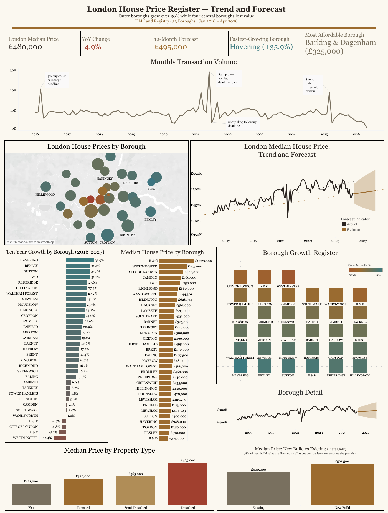
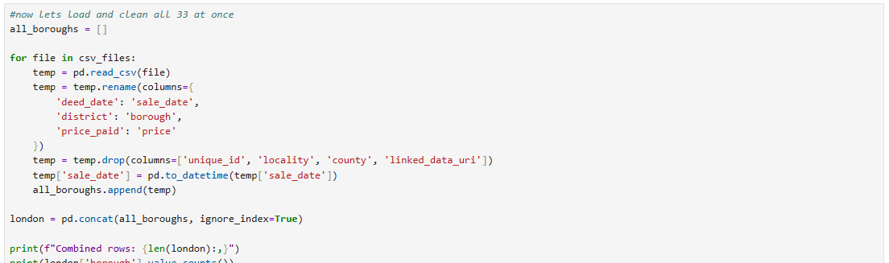
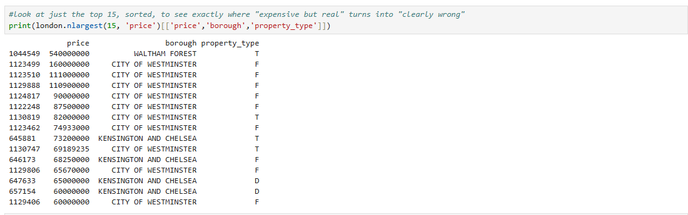
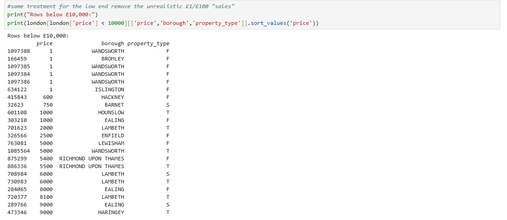
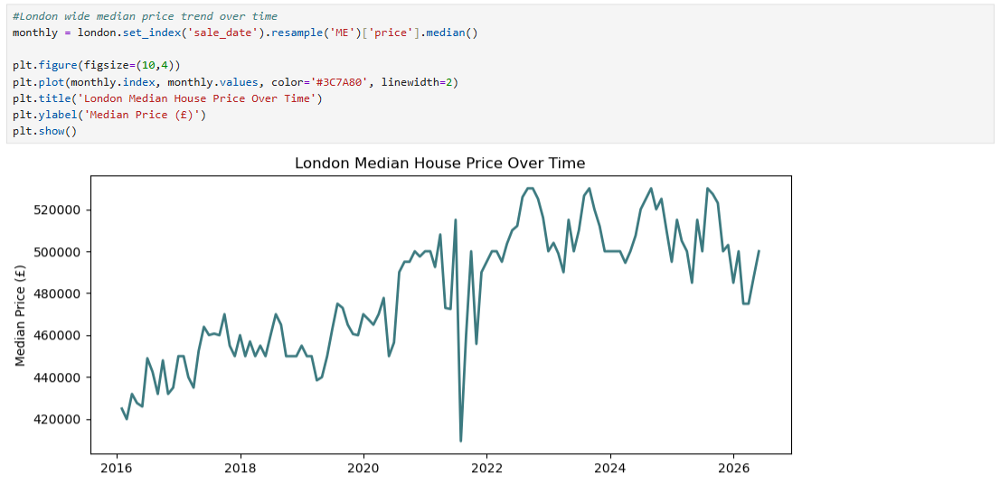
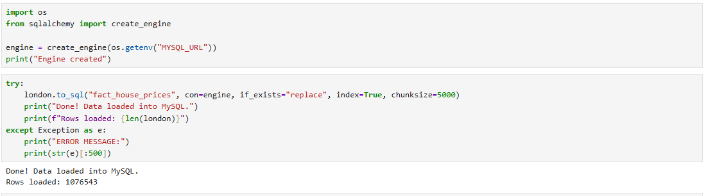
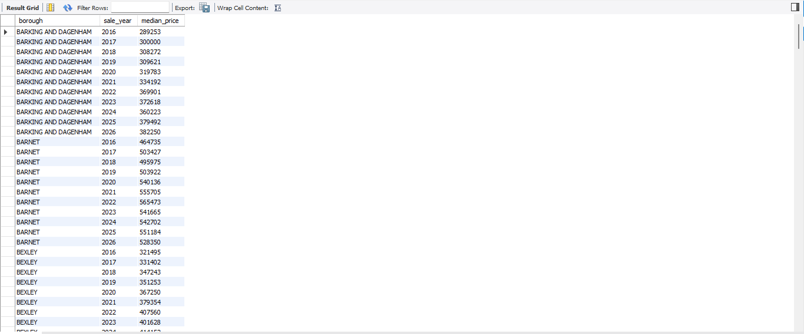
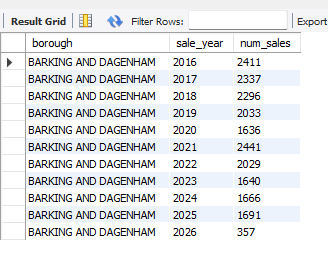
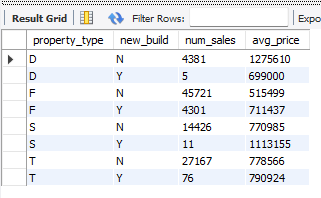
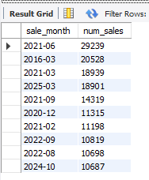

# London House Price Trends and Forecast Dashboard

**Industry:** Property and Real Estate
**Data period:** January 2016 to April 2026

> A note on the data: every figure in this project comes from real, publicly released HM Land Registry Price Paid Data, covering just over one million individual residential sales across all 33 London boroughs over a ten year period. Nothing here is simulated, sampled, or estimated. Every number quoted in this README was checked directly against the underlying Python or SQL output before being written down, and the two findings most likely to be misread were deliberately tested a second time before being published.

**Why this project is here:** most London property dashboards show that prices went up and stop there. This one worked with 1,076,543 real transactions and found a decade that splits cleanly in two. The cheapest outer boroughs grew by more than thirty per cent while four of the most expensive central boroughs lost value outright, with City of Westminster down 15.35 per cent. Along the way, two numbers that looked like clean, quotable findings turned out to be measurement artefacts rather than market behaviour, and both were caught before they reached the dashboard. The full pipeline runs Python through MySQL to an interactive Tableau dashboard, including a Mapbox powered borough map, a corrected ten year forecast, and a transaction volume series where every major spike is matched to a dated change in UK stamp duty policy.

**[View the live, interactive dashboard on Tableau Public](https://public.tableau.com/app/profile/sana.aziz/viz/landregistery_london/LondonHousePrices20162026)**, no download or Tableau licence needed, opens directly in your browser.

---

## Dashboard Preview



---

## TL;DR

A single page Tableau dashboard analysing 1,076,543 real HM Land Registry residential sales across all 33 London boroughs and 124 months, built on a dataset cleaned in Python, aggregated through MySQL views using window functions, and finished as an interactive dashboard with a borough level map, a corrected forecast, and policy annotated transaction volume.

**Key findings:**

- London's median house price rose from roughly £385,000 in 2016 to £480,000 by 2026, but that headline hides a decade that split in two
- The strongest ten year growth came from the cheapest outer boroughs, led by Havering at 35.88 per cent, Bexley at 31.35 per cent, and Sutton at 31.30 per cent
- Four central boroughs lost value outright over the same period, City of Westminster down 15.35 per cent, Kensington and Chelsea down 8.27 per cent, City of London down 4.82 per cent, and Hammersmith and Fulham down 4.68 per cent
- Monthly transaction volume shows three sharp spikes, each followed immediately by a collapse, and all three match dated UK stamp duty changes rather than random market noise
- An apparent price crash in July 2021 turned out to be a low volume artefact of one of those stamp duty deadlines, not a real fall in prices, and was confirmed twice by two independent routes
- The new build premium first measured at 8 per cent, which was arithmetically correct but answering the wrong question. Once property type mix was controlled for, the real premium is 25 per cent on a like for like comparison
- Tableau's automatic forecast selected a model with no trend component at all and projected a flat line, contradicting ten years of visible upward movement. The model was corrected manually and the limitation stated on the dashboard rather than hidden

---

## Project Files

| File | Description | Link |
|---|---|---|
| Python cleaning and analysis | Loads and merges 33 borough level Land Registry exports, handles outliers row by row rather than by blanket cutoff, investigates the July 2021 dip, and loads the result into MySQL | [london_house_prices_cleaned.ipynb](./london_house_prices_cleaned.ipynb) |
| Cleaned dataset | The final cleaned output, also loaded into MySQL as `fact_house_prices`. Not committed in full due to file size, see the notebook to reproduce it | [Sample data](./data/sample_data.csv) |
| SQL queries and views | All business question queries, three reusable views feeding the dashboard, and the follow up checks that tested each headline finding before it was trusted | [london_house_prices_analysis.sql](./sql/london_house_prices_analysis.sql) |
| Tableau dashboard | Full .twbx file, open in Tableau Desktop or Tableau Public to explore | [london_house_prices_dashboard.twbx](./tableau/london_house_prices_dashboard.twbx) |

---

## Why I Built This Project

Everyone in London has an opinion about house prices, and almost all of those opinions are built from one anecdote, a friend who bought at the right moment, a flat that sold for an absurd figure, a headline about the market crashing. I wanted to test that instinct against the actual transaction record rather than against the conversation, and answer a specific question. Over a full decade, who actually gained, and did the expensive parts of London stay expensive because they kept growing, or simply because they started high?

I built this across all 33 boroughs and 124 consecutive months rather than a single year or a handful of well known areas, so the project could show genuine long term movement rather than a snapshot of one market moment. What came out was more interesting than expected. The boroughs that grew fastest are the ones nobody writes about, and four of the most famous postcodes in the country lost value while the rest of the city gained.

The part of this project I would most want to talk through in an interview, though, is not any of the findings. It is the two moments where a number looked clean and turned out to be wrong. A sharp price crash in July 2021 that was not a crash at all, and a new build premium that was correct arithmetic on the wrong comparison. Both were caught by asking a second question rather than by accepting a first answer, and both are documented in full below, including what the wrong version looked like before it was corrected.

---

## Project Overview

A data analysis project looking at residential property prices, growth, transaction volume, and forecast across all 33 London boroughs between January 2016 and April 2026. Built as a portfolio piece using real HM Land Registry open data, working through the full pipeline, raw data, Python cleaning, MySQL, SQL analysis, and an interactive Tableau dashboard.

The project covers **1,076,543 individual property transactions** across **33 boroughs**, **four property types**, and **124 consecutive months**.

The core question is who actually gained over London's last decade, and whether the market moves as one thing or as several. The honest answer is that London has not had one housing market over this period, it has had at least two moving in opposite directions, and the boroughs people assume are the strongest performers are among the weakest.

---

## Insights

#### Datasets

- Source data is HM Land Registry Price Paid Data, downloaded per borough from the Land Registry open data portal
- The cleaned, merged dataset is produced by the Python notebook below and loaded directly into MySQL as `fact_house_prices`
- The full cleaned CSV is 86MB and is not committed to this repository. A 1,000 row sample sits in the `data` folder, and the notebook reproduces the full file end to end

#### Data Cleaning and Analysis

- The full Python cleaning, outlier handling, and exploratory work is in [london_house_prices_cleaned.ipynb](./london_house_prices_cleaned.ipynb)
- The SQL queries, three reusable views, and the follow up checks are in [london_house_prices_analysis.sql](./sql/london_house_prices_analysis.sql)
- The finished Tableau dashboard can be found in this repository as a .twbx file

---

## Tools and Technologies

| Category | Tools |
|---|---|
| Programming and cleaning | Python (Pandas, Matplotlib), Jupyter Notebook |
| Database management | MySQL, SQLAlchemy, PyMySQL |
| Visualisation and reporting | Tableau, including Mapbox powered borough mapping and Tableau forecasting |
| Data storage | CSV files, MySQL views |
| Version control | GitHub |

---

## Project Phases

---

### Phase 1: Data Collection

Source data was taken directly from HM Land Registry's Price Paid Data, which records every residential property sale in England and Wales lodged for registration.

- **Geographic filter:** all 33 London boroughs, including the City of London
- **Time range:** January 2016 to April 2026, 124 consecutive months
- **Collection method:** each borough was downloaded as a separate CSV export from the Land Registry open data portal, then combined into one notebook for cleaning and merging

This produced 33 raw borough level CSV files, each a genuine, unmodified government export covering every registered residential sale in that borough over the period.

---

### Phase 2: Data Cleaning (Python and Pandas)

**Notebook:** [london_house_prices_cleaned.ipynb](./london_house_prices_cleaned.ipynb)

Before any analysis, the raw exports needed real cleaning. The Land Registry files ship with column names that do not travel well, four columns that were not needed for this analysis, dates stored as plain text rather than as dates, and a long tail of transactions at both price extremes that are legally property sales but are not market prices.

**Loading and standardising all 33 borough files**



`glob` was used to collect every borough export automatically rather than repeating the same steps 33 times by hand. Within the loop, `deed_date`, `district`, and `price_paid` were renamed to `sale_date`, `borough`, and `price`, four unused columns were dropped, and `sale_date` was converted from text to a proper datetime. The approach was tested on a single file first before being run against the full set.

**Handling the high end outliers row by row rather than by cutoff**



The obvious move here would have been a blanket price cap, and it would have been wrong. Inspecting the top 15 sales individually showed that the values between £60 million and £160 million, sitting almost entirely in Westminster and Kensington and Chelsea, are genuine. London's super prime market really does transact at that level, and capping the data would have silently deleted the most expensive real sales in the country.

One row did not belong. A £540,000,000 sale in Waltham Forest recorded as a terraced house. There is no terraced house in London worth half a billion pounds, and unlike the genuine super prime sales it would not have been caught by any sensible property type filter either. That single row was removed on its own, by value, rather than swept up in a general rule.

Non residential sales, recorded under property type `O` for Other, were removed as a category, since they are commercial rather than residential transactions and are where the majority of the extreme values originated.

**Handling the low end outliers**



The bottom end needed the opposite treatment. Unlike the high end, there was no ambiguity to inspect. Sales recorded at £1, £100, and anything below £10,000 are not market transactions, they are family transfers, company restructuring, and lease assignments. There is no realistic scenario in which a real semi detached house in London changes hands for £600, even in the cheapest borough, so a straightforward cutoff at £10,000 was the correct tool here where a row by row inspection was correct above.

Cleaning removed just under six per cent of raw rows in total.

**Investigating an apparent price crash in July 2021**



Plotting the London wide monthly median revealed a sharp dip around July 2021, well below the months either side. It would have been easy to leave that in as a pandemic era market wobble and move on. Instead, the transaction count for that specific month was checked rather than only the price.

July 2021 recorded 3,959 sales against a dataset average of 8,612, and against a twenty fifth percentile of 7,327. In other words, that month was quieter than even the quietest normal months in the entire ten year period, sitting closer to the overall minimum. A median calculated from an unusually small and unrepresentative set of sales is not a reliable market signal, and this dip was therefore a low volume artefact rather than a genuine price fall.

This mattered directly for the forecast, since leaving an artificial trough in the series would have distorted any model fitted to it.

**Loading into MySQL**



The cleaned dataframe was loaded into a local MySQL database using `pandas.to_sql()` with `sqlalchemy` and `pymysql`, chunked to handle the volume. Row count in MySQL matched the cleaned CSV exactly.

Final cleaned dataset: **1,076,543 rows**, covering 124 months, 33 boroughs, and four residential property types, loaded into MySQL as the `fact_house_prices` table.

---

### Phase 3: Analysis (SQL)

**Queries:** [london_house_prices_analysis.sql](./sql/london_house_prices_analysis.sql)

Each query below was written to answer a specific business question, and every result was cross checked against the Tableau dashboard before being finalised.

---

**Business question: what is the median price per borough per year?**

MySQL has no built in median function, so the median had to be constructed using `PERCENT_RANK()` to rank every sale within its borough and year, then selecting the rows sitting at the midpoint.

```sql
SELECT borough, sale_year, ROUND(AVG(price)) AS median_price
FROM (
    SELECT borough, sale_year, price,
           PERCENT_RANK() OVER (PARTITION BY borough, sale_year ORDER BY price) AS pct_rank
    FROM (
        SELECT borough, YEAR(sale_date) AS sale_year, price
        FROM fact_house_prices
    ) AS sub
) AS ranked
WHERE pct_rank BETWEEN 0.48 AND 0.52
GROUP BY borough, sale_year
ORDER BY borough, sale_year;
```



---

**Business question: are the missing years in that result a real data gap or a problem with my own query?**

The first version of the median query used a tighter window, between 0.49 and 0.51. The output looked correct at a glance, but Barking and Dagenham was missing 2017, 2020, and 2024 entirely, jumping straight from 2016 to 2018. A dataset with genuinely missing years would change several conclusions, so this needed answering before anything was built on top of it.

```sql
SELECT borough, sale_year, COUNT(*) AS num_sales
FROM (
    SELECT borough, YEAR(sale_date) AS sale_year, price
    FROM fact_house_prices
) AS sub
WHERE borough = 'BARKING AND DAGENHAM'
GROUP BY borough, sale_year
ORDER BY sale_year;
```



Every year was present in the source data with a healthy transaction count. The gap was not in the data, it was in the query. The 0.49 to 0.51 percentile window was simply too narrow to capture any row for certain borough year combinations. Widening it to 0.48 to 0.52 resolved it. This is a good example of why an unexpected result is worth chasing rather than working around, since the instinct in the moment is to assume the data is incomplete.

---

**Business question: which boroughs grew fastest over the decade, and did any lose value?**

```sql
CREATE VIEW vw_borough_growth_ranking AS
SELECT
    borough,
    price_2016,
    price_2025,
    ROUND((price_2025 - price_2016) / price_2016 * 100, 2) AS growth_pct,
    RANK() OVER (ORDER BY (price_2025 - price_2016) / price_2016 DESC) AS growth_rank
FROM (
    SELECT
        borough,
        MIN(CASE WHEN sale_year = 2016 THEN median_price END) AS price_2016,
        MIN(CASE WHEN sale_year = 2025 THEN median_price END) AS price_2025
    FROM vw_median_price_by_borough_year
    GROUP BY borough
) AS yearly;
```


Outer London dominates the top of the ranking. Havering leads at 35.88 per cent, followed by Bexley at 31.35 per cent, Sutton at 31.30 per cent, and Barking and Dagenham at 31.20 per cent, all four of them among the cheapest boroughs in the city at the start of the period.

At the other end, four boroughs recorded genuine decline rather than slower growth. City of Westminster fell 15.35 per cent, Kensington and Chelsea 8.27 per cent, City of London 4.82 per cent, and Hammersmith and Fulham 4.68 per cent.

---

**Business question: is that decline real, or is it an artefact of using a partial year as the endpoint?**

The first version of this ranking used 2026 as the closing year, and produced apparent declines in City of London and Hammersmith and Fulham. Since the dataset ends in April 2026, that year covers roughly one quarter of normal transaction volume, and a partial year is not comparable to a full one. Rebuilding the ranking against 2025 as the final complete year was the correct fix.


The distinction matters. City of London's apparent decline was partly a partial year distortion, and shrank once recalculated. The four declines listed above survived the recalculation intact, which is what makes them worth reporting. They are consistent with known pressures on prime central London over this period, including higher stamp duty rates at the top of the market, reduced international buyer activity, and a broad shift in demand toward outer boroughs.

---

**Business question: how much more expensive is a new build than an existing property?**

The straightforward comparison gives a straightforward answer, and it is misleading.

```sql
SELECT
    property_type,
    new_build,
    COUNT(*) AS num_sales,
    ROUND(AVG(price)) AS avg_price
FROM fact_house_prices
WHERE YEAR(sale_date) = 2025
GROUP BY property_type, new_build
ORDER BY property_type, new_build;
```



Comparing all new builds against all existing stock produced a premium of only 8 per cent, which is well below what is usually reported for the London new build market. Breaking the comparison down by property type explained why. In 2025, 4,301 of 4,393 new build sales were flats, roughly 98 per cent, while existing stock is a mix that includes terraces, semis, and detached houses. Flats are the cheapest property type in the dataset at a £421,000 median against £835,000 for detached.

The all types comparison was therefore measuring the difference in what gets built versus what already exists, not the difference in price between comparable homes. Comparing like with like, new build flats against existing flats, the premium is 25 per cent on medians across the full period.

This is a mix effect, and the original 8 per cent figure was arithmetically correct while answering the wrong question. The dashboard panel was relabelled to make the flats only scope explicit rather than quietly filtered, so a reader can see exactly what is being compared.

---

**Business question: why does transaction volume spike and collapse three times over the decade?**



Monthly transaction volume across the ten year period shows three sharp spikes, each immediately followed by an equally sharp drop the following month. Rather than treating these as unexplained noise, each was investigated individually by checking the exact month and comparing it against known UK stamp duty policy changes.

March 2016 saw a spike to 20,528 sales, followed by a drop to 6,162 in April. This lines up with the introduction of the three per cent stamp duty surcharge on second homes and buy to let purchases, which came into effect on 1 April 2016, prompting buyers to rush completions before the deadline.

June 2021 saw the largest spike in the dataset, followed by a drop to 3,959 sales in July. This lines up with the end of the full stamp duty holiday exemption, introduced during the pandemic and ending on 30 June 2021, again prompting a rush to complete before the deadline.

March 2025 saw a spike to 18,901 sales, followed by a drop to 3,708 in April. This lines up with the reversal of the temporary stamp duty threshold increases that had been in place since September 2022, which reverted to lower thresholds from 1 April 2025, producing the same pattern once more.

All three spikes and drops match real, dateable UK stamp duty policy changes, confirming this as genuine and recurring market behaviour rather than a data error. This also independently confirms the July 2021 price dip identified back in Phase 2, which was found there through transaction volume and here through policy dates, two separate routes arriving at the same explanation.

---

**Reusable views built for the dashboard**

Three views were created so that Tableau connects to clean, pre aggregated tables rather than working directly against over a million raw transaction rows.

| View | Purpose |
|---|---|
| `vw_median_price_by_borough_year` | Median price per borough per year, the base table everything else builds on |
| `vw_yoy_growth_by_borough` | Year on year percentage change per borough, calculated with `LAG()` |
| `vw_borough_growth_ranking` | Ten year growth percentage and rank for all 33 boroughs |

Grid layout positions for the borough growth register panel were also calculated in SQL rather than in Tableau, using modulo and integer division on `growth_rank`, so the visual ordering stays tied to the underlying ranking and cannot drift out of sync with the bar chart beside it.

Views were exported to CSV for the published dashboard, since Tableau Public does not support live database connections.

---

### Phase 4: Dashboard Design and Forecast Investigation (Tableau)

---

## The Dashboard


A single page dashboard built around one question, who gained over London's last decade, with every panel either answering that question or qualifying the answer.

**KPI strip** Five headline figures across the top, London median price at £480,000, year on year change, the twelve month forecast, the fastest growing borough at Havering, and the most affordable at Barking and Dagenham at £325,000.

**Monthly transaction volume** The dashboard's hero panel, running full width, with all three stamp duty spikes annotated directly on the chart rather than explained in a caption elsewhere. A reader sees the pattern and the reason for it in the same glance.

**London house prices by borough, map** A Mapbox powered borough map where circle size carries transaction volume and colour carries median price, showing the central to outer price gradient geographically rather than as a ranked list.

**Median house price trend and forecast** The London wide monthly median with a twenty month forecast and confidence band. The vertical axis deliberately does not start at zero, since starting at zero compresses a decade of movement into a nearly flat line and hides the pattern the panel exists to show.

**Ten year growth by borough** All 33 boroughs ranked, with the zero line visible so the four declining boroughs read as declines rather than as short bars. Showing the full 33 rather than a top ten was a deliberate choice, since the bottom of this chart is the more surprising half.

**Median house price by borough** The price ranking, from Kensington and Chelsea at £1,225,000 down to Barking and Dagenham at £325,000, roughly a four times gap across a single city.

**Borough growth register** A colour coded grid of all 33 boroughs ordered by growth rank, giving the same information as the bar chart in a form that can be read at a glance rather than row by row.

**Median price by property type** Flats at £421,000, terraced at £520,000, semi detached at £565,000, and detached at £835,000, a sensible and expected order that acts as a quiet confirmation the cleaning worked.

**New build premium, flats only** The corrected version of the comparison described in Phase 3, scope stated in the panel title rather than buried, at £400,000 against £501,500.

---

## Forecast Investigation, Naive versus Adjusted Model

Tableau's automatic forecasting feature was applied to the London wide monthly median trend, forecasting twenty months forward to December 2027.

The automatic model selected simple exponential smoothing with no trend and no seasonal component. This produced a forecast that was almost completely flat, showing zero per cent trend contribution and an expected change of £0 across the entire forecast period. That did not match the real pattern in the historical data, where median prices had clearly risen over ten years despite month to month volatility. A default model was quietly contradicting a decade of visible movement.

The model was adjusted manually using Tableau's custom forecast options, setting the trend component to additive while keeping the seasonal component as none, since no genuine twelve month seasonal pattern was detected in either version. The adjusted model produces a forecast that rises in line with the historical trend, projecting a change of approximately £9,654 in median price over the twenty month period, with the movement now correctly attributed to trend rather than ignored.

Both the naive and adjusted models rate Poor on Tableau's own quality metric. That is not a sign the adjustment failed. It reflects a real characteristic of the underlying data, where short term month to month volatility, including the low volume dip investigated earlier, is large relative to the size of the ten year trend. This makes any short term forecast inherently uncertain regardless of model choice.

The adjusted forecast is used, since it reflects the real, verified upward trend rather than defaulting to a flat line. It is presented as directionally indicative rather than as a precise prediction, and that limitation is stated on the dashboard itself rather than left implied.

---

## Skills This Project Demonstrates

- End to end data pipeline construction, from 33 separate government exports, through Python cleaning, MySQL loading, SQL analysis, and finally an interactive Tableau dashboard
- Outlier handling by judgement rather than by rule, inspecting the top of the distribution row by row to separate one genuine data entry error from the genuinely expensive sales around it, while applying a straightforward cutoff at the bottom where no ambiguity existed
- Recognising and correcting a mix effect, catching that a headline comparison was measuring composition rather than price, and reporting both the original figure and the corrected one rather than silently replacing it
- Interrogating an unexpected result rather than working around it, chasing missing years in a query output back to a percentile window that was too narrow rather than assuming the source data was incomplete
- Testing a finding against a second explanation before publishing it, including recalculating the ten year growth ranking against a complete year after identifying a partial year distortion
- Connecting a data pattern to real world policy, matching three transaction volume spikes to dated UK stamp duty changes, and confirming a price anomaly through two independent routes
- Not trusting a default, identifying that Tableau's automatic forecast had selected a model with no trend component, correcting it, and reporting honestly that the corrected model still carries low confidence
- SQL query writing across aggregation, subqueries, and window functions, including `PERCENT_RANK()` to construct a median in a database with no native median function, `LAG()` for year on year change, and `RANK()` for borough level ordering
- Dashboard design discipline, including a non zero baseline where zero would flatten the trend, consistent naming and number formatting across every panel, and stating the scope of a filtered comparison in the panel title rather than hiding it

---

## Key Findings

Start with the headline, because the headline is where most analysis of this data stops. London's median house price rose from roughly £385,000 in 2016 to £480,000 by 2026. Prices went up, the market grew, and if that were the whole story this project would be a single line chart. But that citywide number is an average of two completely different decades happening in the same city at the same time, and separating them is where the data becomes interesting.

The boroughs that grew fastest are the ones nobody writes about. Havering leads the entire city at 35.88 per cent over ten years, followed by Bexley at 31.35 per cent, Sutton at 31.30 per cent, and Barking and Dagenham at 31.20 per cent. All four sat among the cheapest boroughs in London at the start of the period, and Barking and Dagenham remains the cheapest today at a £325,000 median. This is not the pattern most people would predict. The received story of London property is that the expensive areas pull further ahead, and the data says the opposite happened.

Because at the same time, four boroughs lost value outright. City of Westminster fell 15.35 per cent, Kensington and Chelsea 8.27 per cent, City of London 4.82 per cent, and Hammersmith and Fulham 4.68 per cent. These are four of the most recognisable addresses in the country, and over a decade in which London as a whole gained, they went backwards in cash terms before inflation is even considered. That finding was not taken at face value either, since an earlier version of the ranking using a partial 2026 as its endpoint had produced declines that turned out to be measurement artefacts. Rebuilt against 2025 as the last complete year, these four declines held. They are consistent with known pressures on prime central London over this period, higher stamp duty at the top of the market, reduced international buyer activity, and demand shifting outward.

So London has not had one housing market over the past decade, it has had at least two, and they moved in opposite directions. The cheap outer edge gained a third of its value while the expensive centre gave some back. Anyone reading only the citywide median would miss both halves of that entirely.

Transaction volume tells a second story, and this one is almost entirely about policy rather than about property. Three times over the decade, monthly volume spiked hard and then collapsed the following month, and all three match a dated change in stamp duty. March 2016 hit 20,528 sales before falling to 6,162 in April, matching the three per cent surcharge on second homes introduced on 1 April. June 2021 produced the largest spike in the entire dataset before falling to 3,959 in July, matching the end of the pandemic stamp duty holiday on 30 June. March 2025 reached 18,901 before falling to 3,708 in April, matching the threshold reversion on 1 April. The London property market, on this evidence, responds to tax deadlines with more precision and more consistency than it responds to almost anything else.

That finding also resolved something else. An apparent price crash in July 2021, visible as a sharp dip in the median, was not a crash at all. It was the trough immediately after the stamp duty holiday deadline, when only 3,959 sales completed against a monthly average of 8,612. A median calculated from an unusually thin and unrepresentative month is not a market signal. What makes this one worth trusting is that it was found twice, once in Python by checking transaction counts for that specific month, and once in SQL by matching the date to policy, two independent routes arriving at the same answer.

The new build premium is the finding I would most want to be asked about, because the first answer was wrong in an instructive way. Comparing all new builds against all existing stock gave a premium of 8 per cent, which is a clean, quotable number and is far lower than the London new build market is generally understood to command. Breaking it down by property type explained it. Roughly 98 per cent of new build sales are flats, while existing stock includes terraces, semis, and detached houses, and flats are the cheapest type in the dataset. The comparison was measuring what developers build against what already exists, not what comparable homes cost. Restricted to flats against flats, the premium is 25 per cent. Nothing was wrong with the arithmetic. The question was wrong, and that is a harder thing to catch.

Finally, the forecast, which is included here partly because of what it revealed about trusting defaults. Tableau's automatic model chose exponential smoothing with no trend component and projected a flat line, an expected change of exactly £0 across twenty months, in direct contradiction of ten years of visible upward movement in the same chart. Corrected to an additive trend, it projects a modest rise of around £9,654. Both versions rate Poor on Tableau's own quality metric, and that is reported rather than hidden, because it reflects something true about this data. Month to month volatility in London property, much of it driven by the policy deadlines described above, is large relative to the underlying trend. The forecast is directionally useful and no more, and saying so is more honest than presenting a confident number.

---

## Recommendations

Treat outer east and outer south east London as the growth story rather than the affordable alternative. Havering, Bexley, Sutton, and Barking and Dagenham delivered the strongest ten year returns in the city while remaining the cheapest entry points, which is a materially different proposition to the one usually presented about these areas.

Look at prime central London as a separate market with separate drivers. Four central boroughs declined over a decade in which the rest of the city grew, and any citywide model that treats London as a single market will misprice both halves. The decline is consistent with tax and international demand pressures specific to the top of the market rather than with anything affecting London generally.

Plan transaction timing around stamp duty deadlines rather than around market sentiment. Three separate policy changes produced the same spike and collapse pattern within a month either side of the deadline, and the effect is large enough to distort any monthly metric that crosses one of those dates. Any analysis of a month adjacent to a stamp duty change should check volume before drawing conclusions from price.

Quote the new build premium with its scope attached. The all types figure of 8 per cent and the flats only figure of 25 per cent are both derived from the same data and only one of them answers the question people are actually asking. Any new build pricing decision using the lower figure would materially understate the market.

Present the forecast as direction rather than as a number. Given the volatility this dataset carries, a specific projected value implies more precision than the data supports, and the honest use of this forecast is to confirm the trend remains upward rather than to predict a price.

---

## Limitations

- 2026 figures cover only January to April, so any comparison involving 2026 as a full year is not directly comparable to a complete prior year. All ten year growth figures deliberately use 2025 as the endpoint for this reason
- Median was constructed using `PERCENT_RANK()` and averaging rows in a 0.48 to 0.52 percentile band, since MySQL has no native median function. This is a close approximation rather than a true median, and for borough year combinations with low transaction counts it may drift slightly
- Growth is measured in nominal terms and is not adjusted for inflation. A borough showing modest positive growth over ten years may still have lost value in real terms, and that comparison is not made here
- The new build premium is reported for flats only, as explained above. It is not a general statement about new build houses, where transaction volumes in this dataset are too low to support a reliable comparison
- Price Paid Data records the sale price and property type but carries no information on floor area, condition, or number of bedrooms, so price per square foot and any true like for like quality comparison are outside the scope of this dataset
- The forecast reflects historical trend only and does not incorporate interest rates, planning policy, or supply forecasts, all of which would materially affect any real projection

---

## What Could Be Added With More Time

- A real terms growth view, deflating each borough's median by ONS CPI, to separate boroughs that genuinely gained value from those that merely kept pace with inflation. On the nominal figures, several boroughs sitting in positive territory would likely move into negative once adjusted, which would sharpen the central versus outer split considerably
- A price to income affordability measure by borough, joining ONS earnings data, which is closer to the question most London buyers are actually asking than absolute price is
- A stamp duty impact quantification, estimating how many transactions were pulled forward across each of the three deadlines rather than only identifying that the effect exists
- A property type breakdown by borough, to test whether the outer borough growth story is uniform across housing types or is being driven by one particular segment
- A dedicated flat level new build analysis across the full period rather than a single year, to establish whether the 25 per cent premium is structurally stable or specific to recent market conditions

---

## Data Source

HM Land Registry, [Price Paid Data](https://www.gov.uk/government/statistical-data-sets/price-paid-data-downloads), Open Government Licence. Contains HM Land Registry data © Crown copyright and database right. This data is licensed under the Open Government Licence v3.0.

---

## About Me

I built this dashboard as part of my own practice in data analysis and business intelligence, with a particular interest in property, transport, and public data. I am currently looking for opportunities in London within data analysis or business intelligence roles, and I would welcome the chance to talk through this project, the choices behind it, or any part of the underlying data model.

Feel free to open the .twbx file yourself, explore the dashboard, and reach out with any questions or feedback.

---

## Contact

**Sana Aziz**

Data Analyst | SQL, Excel, Power BI, Tableau, Python

London, UK
[LinkedIn](https://www.linkedin.com/in/sana-aziz-analyst-uk/)
